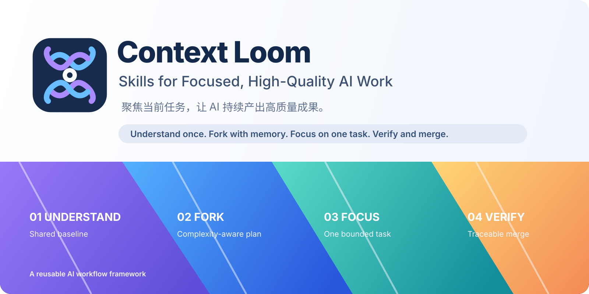
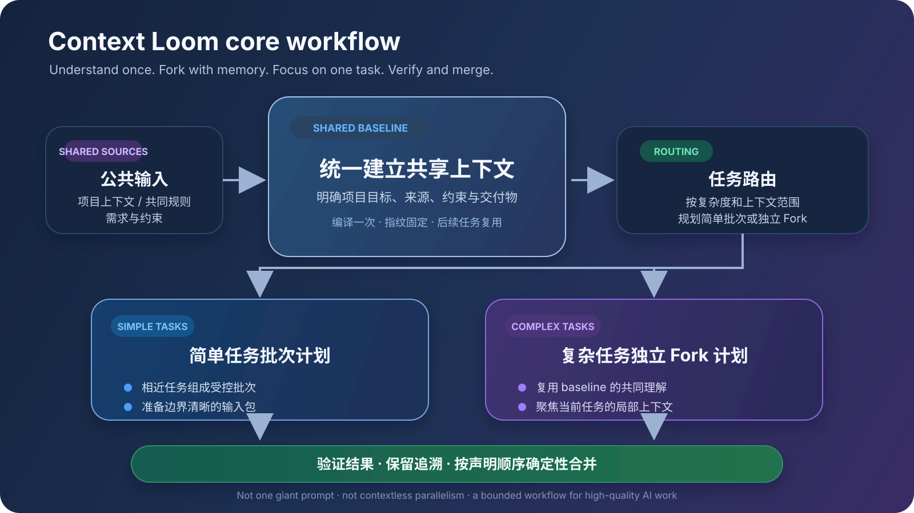

# Context Loom

## Skills for Focused, High-Quality AI Work

让 AI 不迷失上下文，聚焦当前任务，持续产出高质量成果。

A reusable AI workflow framework for shared-context reasoning, complexity-aware forking, focused execution, and traceable aggregation.

> Understand once.  
> Fork with memory.  
> Focus on one task.  
> Verify and merge.



Context Loom turns long, context-heavy AI work into bounded, verifiable units without making
every worker rediscover the project from scratch. It compiles shared sources into a fingerprinted
baseline, routes work by complexity, prepares focused worker packets, validates structured
results, and assembles accepted results deterministically.

It is not one giant prompt and it is not tied to a single model. The framework separates:

- **Skills** — user-facing workflows organized by engineering domain.
- **Runtime** — deterministic baseline, planning, state, validation, and assembly code.
- **Adapters** — integrations that map the execution plan to Codex, Claude, or another agent host.

## The workflow



The current core prepares a simple-batch or dedicated-fork **plan and worker packets**. Launching
agent sessions and actual forks belongs to an adapter; it is not yet part of the `0.1.0` CLI.

## Repository layout

```text
skills/                         User-facing, composable workflows
  framework/                    Context Loom setup and orchestration
  engineering/software-testing First domain workflow
src/context_loom/               Reusable deterministic runtime
schemas/                        Portable JSON contracts
docs/                           Architecture and extension guides
examples/                       Runnable workflow examples
tests/                          Runtime and end-to-end verification
```

## Quick start

```powershell
git clone https://github.com/zhangyudi-01/context-loom.git
cd context-loom
python -m pip install -e .

context-loom init .\demo --workflow-id demo-workflow
context-loom compile .\demo
context-loom plan .\demo
context-loom prepare-next .\demo
```

An agent adapter consumes the packet and returns one structured result per task:

```powershell
context-loom submit .\demo --result .\worker-result.json
context-loom assemble .\demo
context-loom status .\demo
```

See [the minimal example](examples/minimal-workflow/README.md) for a complete local run.

## Core invariants

1. **Source files remain the facts.** A baseline is a compiled, fingerprinted view, not a replacement.
2. **Every task is bounded.** A worker receives the shared baseline plus only its authorized task scope.
3. **Complexity changes topology.** Compatible simple tasks may share a batch; complex tasks receive a dedicated fork plan.
4. **Sibling history is not evidence.** One task cannot depend on another worker's conversation or tool trace unless declared.
5. **State is explicit.** JSON state and file hashes control recovery; logs are audit evidence, not scheduling input.
6. **AI reasons locally; code assembles globally.** Accepted results are ordered and merged deterministically.

## Current status

Version `0.1.0` implements the model-independent control plane:

- baseline source resolution and SHA-256 fingerprints;
- stable simple-batch and dedicated-fork planning;
- atomic workflow state;
- focused packet generation;
- structured result submission and scope validation;
- deterministic Markdown assembly and traceability JSON;
- initial Context Loom and software-testing Skills;
- portable JSON schemas and a runnable example.

Direct Codex/Claude process invocation is adapter work. The core can already prepare, validate,
recover, and assemble work without coupling its state machine to one CLI.

## Documentation

- [Architecture](docs/architecture.md)
- [Core concepts](docs/concepts.md)
- [Workflow lifecycle](docs/workflow-lifecycle.md)
- [Writing a domain workflow](docs/writing-a-domain-workflow.md)
- [Agent adapters](docs/agent-adapters.md)
- [Migration from existing testing Skills](docs/migration-from-existing-skills.md)

## License

MIT
